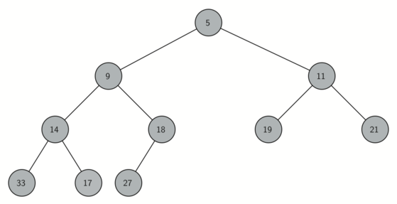

One important variation of the queue is the **priority queue**. A priority queue
acts like a queue in that items remain in it for some time before being
dequeued. However, in a priority queue the logical order of items inside a queue
is determined by their “priority”. Specifically, the highest priority items are
retrieved from the queue ahead of lower priority items.

We will see that the priority queue is a useful data structure for specific
algorithms such as Dijkstra’s shortest path algorithm. More generally though,
priority queues are useful enough that you may have encountered one already:
message queues or tasks queues for instance typically prioritize some items over
others.

You can probably think of a couple of easy ways to implement a priority queue
using sorting functions and arrays or lists. However, sorting a list is $$O(n
\log{n})$$. We can do better.

The classic way to implement a priority queue is using a data structure called a
**binary heap**. A binary heap will allow us to enqueue or dequeue items in
$$O(\log{n})$$.

The binary heap is interesting to study because when we diagram the heap it
looks a lot like a tree, but when we implement it we use only a single dynamic
array (such as a Python list) as its internal representation. The binary heap
has two common variations: the **min heap**, in which the smallest key is always
at the front, and the **max heap**, in which the largest key value is always at
the front. In this section we will implement the min heap, but the max heap is
implemented in the same way.

The basic operations we will implement for our binary heap are:

-   `BinaryHeap()` creates a new, empty, binary heap.
-   `insert(k)` adds a new item to the heap.
-   `find_min()` returns the item with the minimum key value, leaving
    item in the heap.
-   `del_min()` returns the item with the minimum key value, removing the
    item from the heap.
-   `is_empty()` returns true if the heap is empty, false otherwise.
-   `size()` returns the number of items in the heap.
-   `build_heap(list)` builds a new heap from a list of keys.

The Structure Property
----------------------

In order for our heap to work efficiently, we will take advantage of
the logarithmic nature of the binary tree to represent our heap. In
order to guarantee logarithmic performance, we must keep our tree
balanced. A balanced binary tree has roughly the same number of nodes in
the left and right subtrees of the root. In our heap implementation we
keep the tree balanced by creating a **complete binary tree**. A
complete binary tree is a tree in which each level has all of its nodes.
The exception to this is the bottom level of the tree, which we fill in
from left to right. This diagram shows an example of a
complete binary tree:

Another interesting property of a complete tree is that we can represent it
using a single list. We do not need to use nodes and references or even lists of
lists. Because the tree is complete, the left child of a parent (at position
$$p$$) is the node that is found in position $$2p$$ in the list. Similarly, the
right child of the parent is at position $$2p + 1$$ in the list. To find the
parent of any node in the tree, we can simply use integer division (like normal
mathematical division except we discard the remainder). Given that a node is at
position $$n$$ in the list, the parent is at position $$n/2$$.

The diagram below shows a complete binary tree and also gives the list
representation of the tree. Note the $$2p$$ and $$2p+1$$ relationship between
parent and children. The list representation of the tree, along with the full
structure property, allows us to efficiently traverse a complete binary tree
using only a few simple mathematical operations. We will see that this also
leads to an efficient implementation of our binary heap.

The Heap Order Property
-----------------------

The method that we will use to store items in a heap relies on maintaining the
heap order property. The **heap order property** is as follows: In a heap, for
every node $$x$$ with parent $$p$$, the key in $$p$$ is smaller than or equal to
the key in $$x$$. The diagram below also illustrates a complete binary tree that
has the heap order property.

Heap Operations
---------------

<!-- literate trees/binary_heap.py -->
